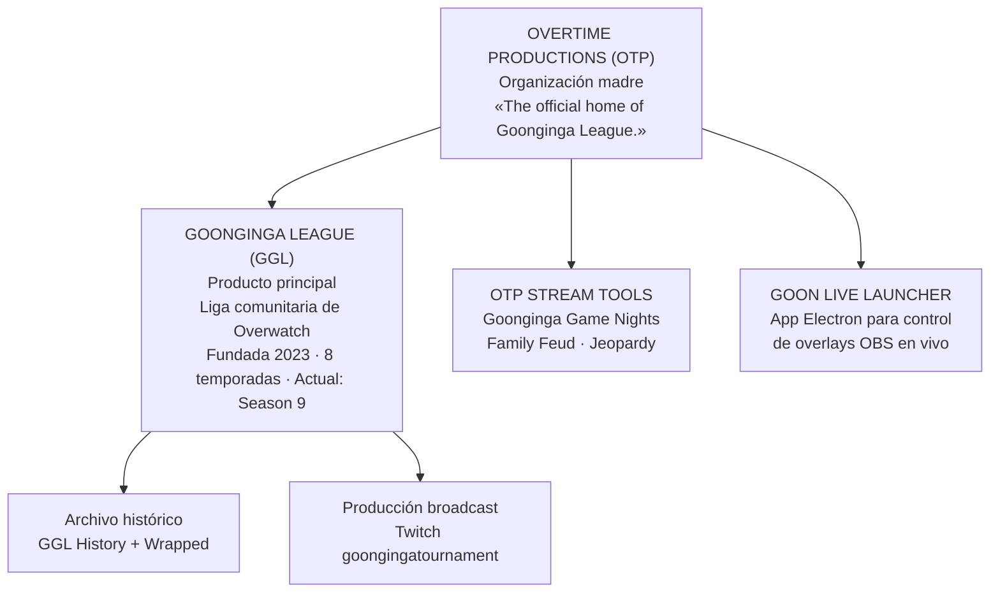
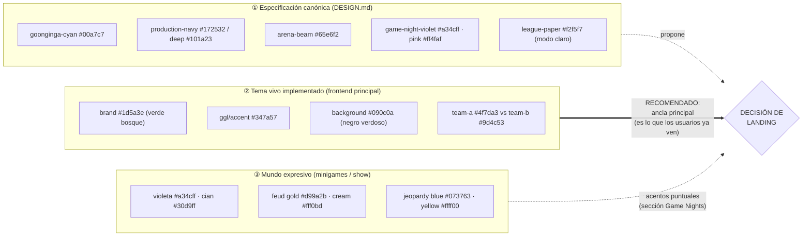
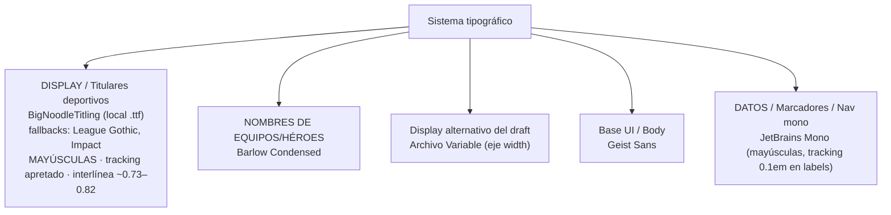
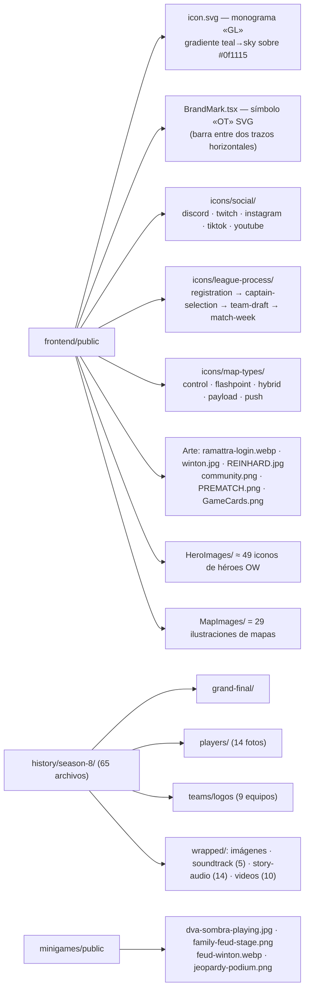
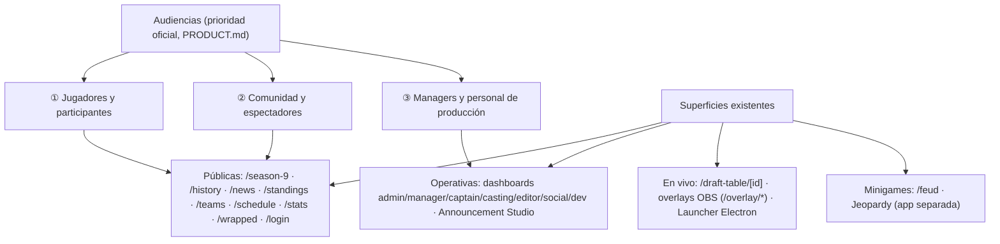
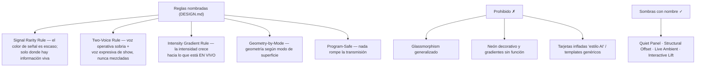
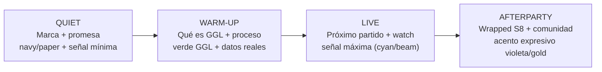
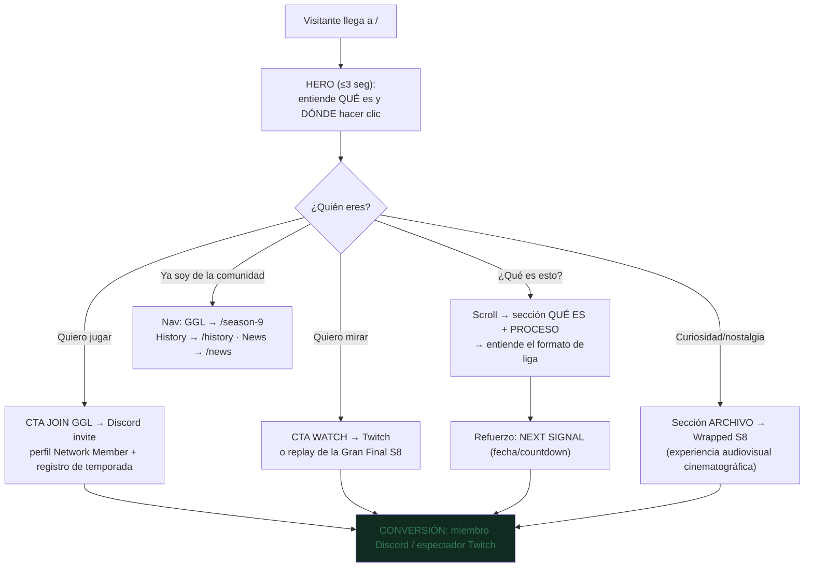
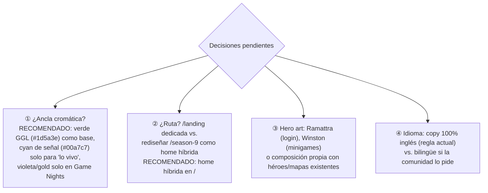

# OVERTIME PRODUCTIONS — Documentación de Marca + Propuesta de Landing

> Documento de entendimiento basado en el escaneo completo del repositorio (`README.md`, `PRODUCT.md`, `DESIGN.md`, código del frontend/minigames/launcher, assets y datos históricos). Sin código: solo comprensión mediante grafos.

---

## PARTE 1 — DOCUMENTACIÓN DE MARCA

### 1.1 Arquitectura de marca (marcas madre e hijas)

**Lectura:** OTP es la casa editorial; GGL es el producto estrella; Stream Tools y el Launcher son herramientas de producción que refuerzan la identidad de "estudio de transmisión".

---

### 1.2 Identidad verbal

| Elemento | Valor canónico | Fuente |
|---|---|---|
| Nombre público | **Overtime Productions** (dos palabras, siempre) | Navbar |
| Abreviatura | OTP | PRODUCT.md |
| Descriptor oficial | *"The official home of Goonginga League."* | layout.tsx |
| Norte creativo | **"The Community Broadcast Arena"** | DESIGN.md |
| Principio de sistema | **"The Matchday Signal System"** | DESIGN.md |
| Definición de marca | *"A disciplined community broadcast arena for competition, league operations, and live play."* | DESIGN.md |

**Tono:** comunitario pero disciplinado; competitivo, juguetón y energético; habla como un estudio de broadcast real, no como template de torneos ni dashboard SaaS.
**Idioma:** todo el copy público en inglés.
**Regla de honestidad:** solo datos verificables (fundación 2023, 8 temporadas, 122 mapas en S8). Prohibido inventar testimonios o cifras de audiencia.

---

### 1.3 Sistema cromático ⚠️ (hallazgo clave)

Conviven **tres identidades cromáticas**. Un landing debe decidir cuál ancla la identidad pública.

**Colores funcionales transversales:** success `#178461` · danger `#d94a59` · warning `#bd944f` · score-signal `#ffff00`.
**Colores de equipo (draft/transmisión):** Team A azul `#4f7da3/#7fb0d8` vs Team B rojo `#9d4c53/#d8848a`.

---

### 1.4 Tipografía

**Escala de referencia (DESIGN.md):** Display `clamp(5.5rem → 10.8rem)` · Headline 7.2rem · Title 1.125rem/700 · Body 1rem/1.5 · Label 0.75rem/800 uppercase.

---

### 1.5 Inventario de activos de marca

---

### 1.6 Ecosistema de superficies y audiencias

**Canales oficiales:** Discord `discord.gg/QMukTWr32f` (identidad/login vía OAuth, guild `987039120004104232`) · Twitch `twitch.tv/goongingatournament`. Sin email ni formulario público: **Discord es el punto de conversión**.

---

### 1.7 Reglas de marca (del sistema de diseño)

---

### 1.8 Prueba social verificable disponible (Season 8)

| Dato | Valor |
|---|---|
| Temporada cerrada | Season 8 ("Goonginga Season 8!", inició 2026-05-11) |
| Escala | 9 equipos · 45 jugadores · 122 mapas · 13 semanas |
| Totales | 8.506.600 daño · 4.626.730 curación · 2.791.754 mitigación |
| Metas | Mapa más elegido: Lijiang Tower (16) · Héroe más baneado: Kiriko (27) |
| Líderes | OTISDIK (daño) · SHELLBLADE (curación) · Arterrat (mitigación) |
| Campeón regular | No Tank? (7-1) · Gran Final jugada 2026-08-08 |

---

## PARTE 2 — PROPUESTA DE LANDING PAGE

### 2.0 Problema actual

`/` redirige directamente a `/season-9`: no existe un landing de marca. El visitante nuevo aterriza en una página operativa austera, sin entender qué es OTP/GGL, cuándo es la próxima transmisión ni cómo entrar. Los commits recientes ("redesign overtime landing experience") confirman la intención.

**Objetivo del landing:** convertir al visitante en miembro (Discord) o espectador (Twitch) en <10 segundos, usando la estética "Community Broadcast Arena".

---

### 2.1 Concepto creativo: «THE MATCHDAY SIGNAL»

El landing se comporta como **la señal previa al partido**: una sala de transmisión comunitaria que pasa de "quieto" (marca) a "en vivo" (acción). La intensidad visual crece a medida que el usuario scrollea hacia lo vivo (Intesity Gradient Rule aplicada al scroll).

---

### 2.2 Mapa de secciones (anatomía vertical)

```mermaid
graph TD
    S0["NAV — sticky blur mono<br/>Overtime Productions · GGL · History · News · [Join Discord] · [Log in]"]

    S0 --> HERO["① HERO — 'THE COMMUNITY BROADCAST ARENA'<br/>Eyebrow mono: GOONGINGA LEAGUE · SEASON 9<br/>H1 BigNoodle gigante · Sub: liga por temporadas desde 2023<br/>CTA primario: JOIN GGL (→Discord) · secundario: WATCH (→Twitch)<br/>Fondo: arte Ramattra/Winston tratado, beam sutil animado"]

    HERO --> TICKER["② SIGNAL BAR — cinta mono en movimiento<br/>SEASON 9 · REGISTRATION OPEN · GRAND FINAL S8 REPLAY ON TWITCH<br/>· 9 TEAMS · 45 PLAYERS · 122 MAPS PLAYED LAST SEASON"]

    TICKER --> WHAT["③ QUÉ ES GGL — dos columnas<br/>Izq: statement editorial grande<br/>Der: tarjeta operativa con estado de temporada (badge-signal)<br/>Copy: registration → captains → draft → match weeks"]

    WHAT --> PROCESS["④ EL PROCESO — 4 pasos horizontales<br/>iconos league-process existentes (SVG)<br/>REGISTRATION / CAPTAIN SELECTION / TEAM DRAFT / MATCH WEEK<br/>línea conectora tipo timeline de producción"]

    PROCESS --> NOW["⑤ LO VIVO — 'NEXT SIGNAL'<br/>próxima fecha o estado de Season 9<br/>formato confirmado: hero bans (máx 2 por rol por mapa)<br/>tarjeta estilo match-header con team colors azul/rojo<br/>si NO hay fecha: countdown + 'format confirmed' card"]

    NOW --> HISTORY["⑥ EL ARCHIVO — 'EIGHT SEASONS DEEP'<br/>métricas S8 en JetBrains Mono grandes<br/>mini-mosaico: logos de los 9 equipos + foto Gran Final<br/>CTA: EXPLORE GGL HISTORY → /history · WATCH THE WRAPPED → /wrapped"]

    HISTORY --> SHOW["⑦ GAME NIGHTS — franja expresiva (única sección con paleta show)<br/>violeta/gold: Family Feud + Jeopardy<br/>'Not every night is a match night.'<br/>arte: family-feud-stage.png · dva-sombra-playing.jpg"]

    SHOW --> COMMUNITY["⑧ COMUNIDAD — 'THE ARENA IS THE PEOPLE'<br/>foto community.png · mosaico jugadores S8<br/>quote real del Wrapped: THANK YOU FOR SHOWING UP.<br/>CTA: JOIN THE DISCORD"]

    COMMUNITY --> FOOT["⑨ FOOTER — lockup OTP + monograma GL<br/>social icons (los 5 SVG) · mapa de rutas públicas<br/>© Overtime Productions"]

    style HERO fill:#101a23,color:#65e6f2
    style NOW fill:#17221b,color:#ffff00
    style SHOW fill:#230c12,color:#ff4faf
```

---

### 2.3 Flujo de conversión (journeys de usuario)

---

### 2.4 Coreografía visual por sección (sin código)

| # | Sección | Movimiento | Intensidad |
|---|---|---|---|
| ① | Hero | Entrada typewriter en eyebrow; H1 cae con easing `--ease-out`; beam de fondo respira lento | Media-alta |
| ② | Ticker | Marquee continuo mono, pausa on-hover | Baja constante |
| ③④ | Qué es / Proceso | Reveal escalonado on-scroll; línea de timeline se dibuja (scaleX) | Baja |
| ⑤ | Next Signal | Badge pulsante (`pulse-glow`); countdown mono; colores de equipo solo aquí | **ALTA (pico)** |
| ⑥ | Archivo | Mosaico de logos con lift interactivo; números que cuentan hasta su valor | Media |
| ⑦ | Game Nights | Cambio de mundo cromático (violeta/gold); micro-animaciones teatrales | Media-expresiva |
| ⑧⑨ | Comunidad/Footer | Fade sereno; cierre quieto | Baja |

**Accesibilidad:** respetar `prefers-reduced-motion` (ya existe globalmente); focus visible `#88ad95`.

---

### 2.5 Copy propuesto (inglés, tono de marca)

| Bloque | Copy |
|---|---|
| Hero eyebrow | `GOONGINGA LEAGUE — SEASON 9` |
| Hero H1 | `THE COMMUNITY BROADCAST ARENA` |
| Hero sub | *Eight seasons of drafted teams, weekly broadcasts, and one loud Discord server. This is where it all plays out.* |
| CTAs | `JOIN GGL` · `WATCH LIVE` |
| Ticker items | `SEASON 9 UNDERWAY` • `FORMAT CONFIRMED: MAX 2 HERO BANS PER ROLE PER MAP` • `S8: 122 MAPS · 45 PLAYERS · 9 TEAMS` |
| Qué es (statement) | *Overtime Productions runs the Goonginga Overwatch League — a full-season amateur competition with real drafts, real standings, and a production crew behind every broadcast.* |
| Proceso labels | `01 REGISTRATION` → `02 CAPTAIN SELECTION` → `03 TEAM DRAFT` → `04 MATCH WEEK` |
| Next Signal heading | `NEXT SIGNAL` |
| Archivo heading | `EIGHT SEASONS DEEP.` |
| Archivo stats | `122 maps played` · `45 players` · `13 weeks` · `4.6M healing done` |
| Game Nights | `NOT EVERY NIGHT IS A MATCH NIGHT.` — *Game Nights bring Family Feud and Jeopardy to the stream.* |
| Comunidad | `THE ARENA IS THE PEOPLE.` — *Thank you for showing up.* |

---

### 2.6 Decisiones abiertas (requieren definición)

---

### 2.7 Resumen ejecutivo

El landing debe vender **tres verdades verificables** en un scroll: (1) esta es una liga real con historia (8 temporadas, datos duros), (2) está viva ahora mismo (Season 9 + señal de próximo evento), y (3) entrar es un clic (Discord/Twitch). Todo con el lenguaje visual ya definido: BigNoodle para gritar, JetBrains Mono para informar, verde GGL para habitar, y color de señal reservado exclusivamente para lo que está en juego.
