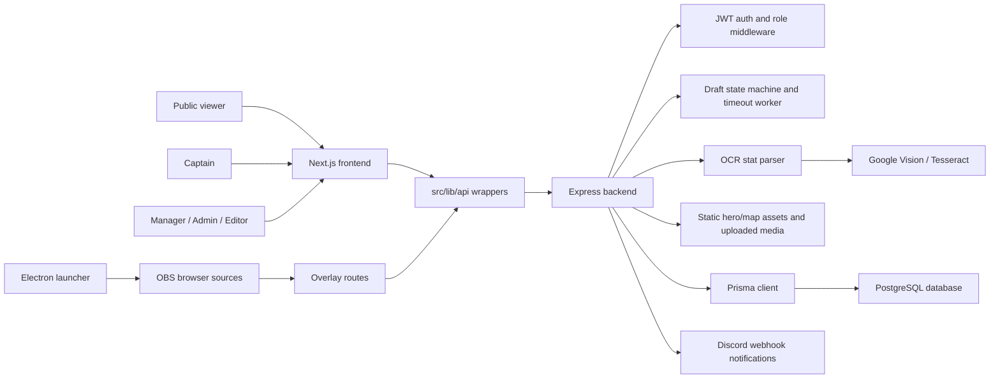
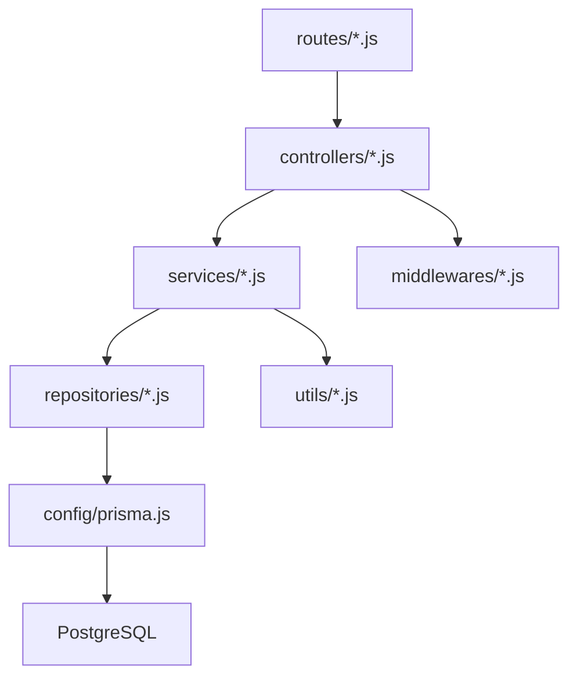
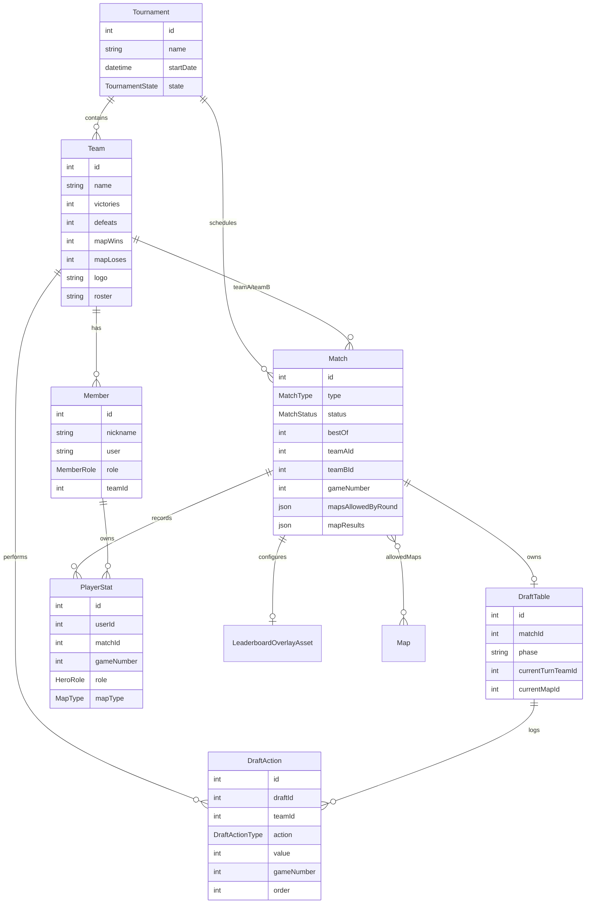
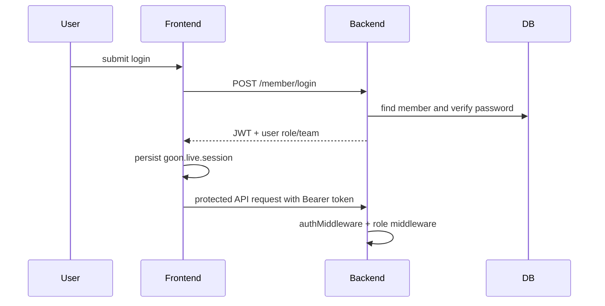
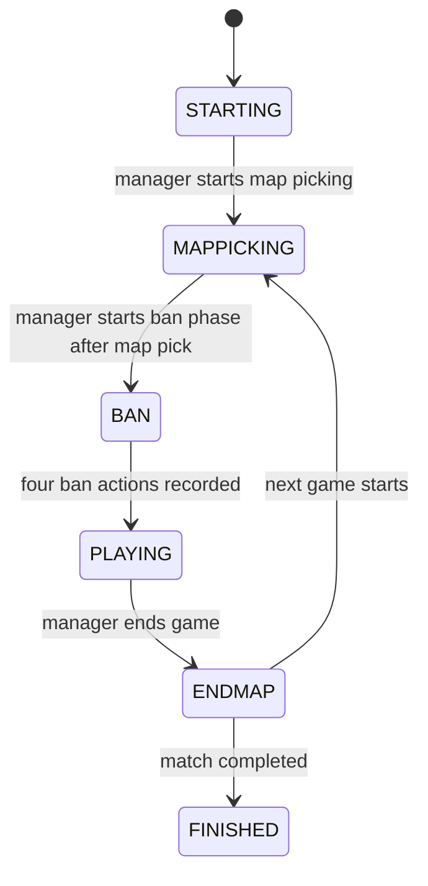
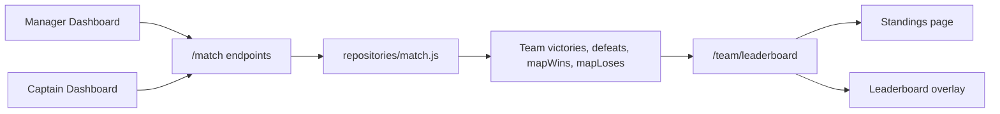
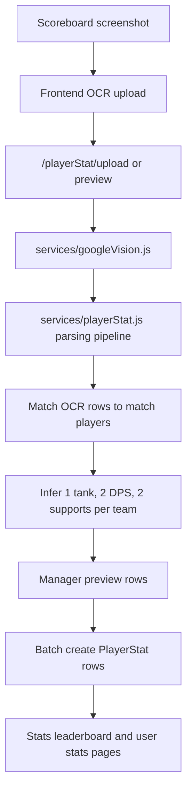
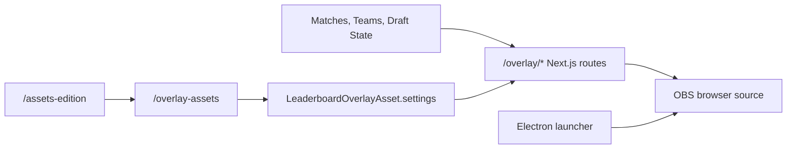
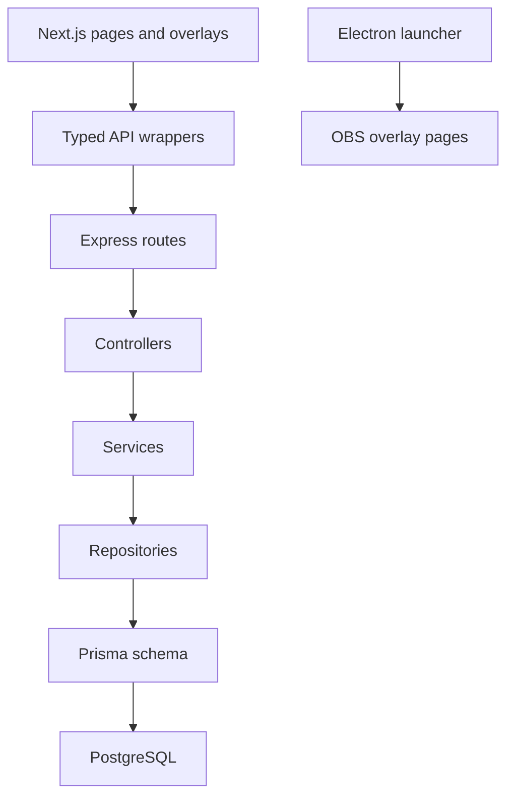

# Goonginga League Live Platform

Goonginga League Live Platform is a full-stack operations system for an
Overwatch-style league. It combines a public league website, authenticated admin
and captain tools, a live draft table, OBS-ready broadcast overlays, OCR-based
stat registration, and a Windows Electron launcher for local overlay control.

This README is intentionally architecture-oriented so tools such as GitDiagram
can produce a useful repository diagram.

## System Overview



## Workspace Map

```text
.
|-- package.json                         Root convenience scripts
|-- README.md                            Architecture guide for humans and GitDiagram
|-- migration-uidesign/
|   |-- frontend/                        Next.js App Router application
|   |   |-- src/app/                     Pages, dashboards, draft table, overlays
|   |   |-- src/components/              UI, layout, draft, match, news, team components
|   |   |-- src/features/session/        JWT session context and localStorage persistence
|   |   |-- src/features/liveHub/        Aggregated live operations snapshot
|   |   |-- src/hooks/                   Draft/server timers and polling hooks
|   |   |-- src/lib/api/                 Typed API client wrappers
|   |   |-- src/lib/overlay/             Overlay settings and helpers
|   |   |-- HeroImages/                  Hero artwork served by backend
|   |   |-- MapImages/                   Map artwork served by backend
|   |   `-- public/                      Site assets and fonts
|   |-- backend/                         Express API and Prisma data layer
|   |   |-- app.js                       Server entry point and route mounting
|   |   |-- routes/                      HTTP route definitions
|   |   |-- controllers/                 Request orchestration and domain workflows
|   |   |-- services/                    Business logic and parsing services
|   |   |-- repositories/                Prisma query helpers
|   |   |-- middlewares/                 Auth and role checks
|   |   |-- prisma/                      Schema, migrations, seeds
|   |   |-- scripts/                     DB seed, backup, wipe, sequence utilities
|   |   `-- utils/                       Image upload, Discord, DB backup, bootstrap helpers
|   `-- launcher/                        Electron launcher for local OBS workflows
|       |-- main.js                      Electron main process
|       |-- preload.js                   Safe bridge into renderer
|       |-- renderer.js                  Launcher UI behavior
|       |-- overlayController.js         OBS websocket integration
|       `-- package.json                 Electron builder config
```

## Major Applications

### Frontend: `migration-uidesign/frontend`

The frontend is a Next.js App Router application with typed API wrappers and a
client-side session provider.

Important route groups:

- `/`: public home page with league highlights, matches, standings, teams, news.
- `/login`, `/profile`: authentication and user profile surfaces.
- `/admin-dashboard`: tournament, match, team, member, map pool, and admin tools.
- `/admin-dashboard/overwatch-content`: map and hero content management.
- `/manager-dashboard`: live match operations, result registration, OCR stat upload.
- `/captain-dashboard`: captain match controls and team-specific operations.
- `/draft-table/[matchId]`: live map-pick and hero-ban draft interface.
- `/standings`, `/teams`, `/schedule`, `/stats`, `/news`: public league views.
- `/assets-edition`: broadcast asset and overlay setting editor.
- `/overlay/*`: OBS browser-source pages for leaderboard, roster, match header,
  map pool, and win cards.

Frontend support modules:

- `src/lib/api/client.ts`: base API request wrapper, `ApiError`, timeout handling.
- `src/lib/api/*.ts`: typed wrappers for member, team, match, draft, player stats,
  overlays, news, map, hero, and admin endpoints.
- `src/features/session`: stores JWT user session in localStorage and React context.
- `src/features/liveHub`: aggregates leaderboard, active matches, draft state, and
  player stats for operational views.
- `src/components/ui`: reusable UI primitives used across pages.
- `src/components/draft`: draft board, timer, map picker, hero banner, map image.
- `src/app/overlay/components`: visual broadcast overlay components.

### Backend: `migration-uidesign/backend`

The backend is an Express API using Prisma against PostgreSQL. The server starts
from `app.js`, checks database health, mounts routes, serves hero/map assets, and
starts a draft timeout worker.

Layering pattern:



Mounted API areas:

- `/member`: register, login, member profile, team/member updates.
- `/tournament`: tournament CRUD.
- `/team`: teams and leaderboard.
- `/match`: schedule, active matches, result submission, pause controls.
- `/draft`: authoritative live draft state machine.
- `/draftTable`, `/draftAction`: legacy/admin draft table and action routes.
- `/playerStat`: manual stats, OCR preview, OCR upload, batch stat creation.
- `/news`: news feed and editor/admin publishing.
- `/map`, `/hero`: Overwatch map and hero content.
- `/overlay-assets`: persisted overlay backgrounds and settings.
- `/system-db`: backup/restore/wipe-style system database utilities.
- `/health`: database connectivity probe.

### Launcher: `migration-uidesign/launcher`

The launcher is an Electron app for Windows local production workflows. It ships
the launcher UI and backend resources, talks to OBS through `obs-websocket-js`,
and helps control local overlay/browser-source setup.

## Domain Model



## Core Workflows

### Authentication and Roles



Roles in the system:

- `ADMIN`: global content, users, tournament, and system controls.
- `MANAGER`: match operations, draft creation/control, results, OCR/stat review.
- `CAPTAIN`: team-ready actions, match participation, draft pick/ban actions.
- `EDITOR`: news/content publishing.
- `DEFAULT`: regular authenticated user.

### Live Draft Flow

The live draft is centered on `DraftTablePage` in the frontend and
`controllers/draft.js` in the backend.



Draft details:

- Managers/admins create drafts and start phases.
- Captains act only for their own team.
- Managers/admins can act for either team by passing a team id.
- Read-only `?key=` access supports OBS/overlay-style viewers.
- Server polling returns authoritative remaining seconds.
- A backend timeout worker applies skips/random map picks if turns expire.
- Draft actions are stored as ordered `DraftAction` rows per game.

### Match, Leaderboard, and Schedule Flow



Leaderboard ranking uses:

1. Match wins (`victories`) descending.
2. Map differential (`mapWins - mapLoses`) descending.
3. Team id ascending as a stable tiebreaker.

### OCR Stat Registration



OCR/parsing responsibilities:

- Extract text and word geometry from screenshots.
- Reconstruct scoreboard rows from spatial/numeric layout.
- Fuzzy-match OCR nicknames to known match players.
- Keep unmatched nicknames visible for manual correction.
- Infer roles per team so each five-player block has one tank, two DPS, and two
  supports.
- Normalize per-10-minute player stat metrics.

### Broadcast Overlay Flow



Overlay pages are designed for OBS browser sources and include:

- `/overlay/leaderboard/[id]`
- `/overlay/map-pool/[matchid]`
- `/overlay/map-pool-clean/[matchId]`
- `/overlay/match-header/[matchId]`
- `/overlay/match-header-reversed/[matchId]`
- `/overlay/roster-a/[id]`
- `/overlay/roster-b/[id]`
- `/overlay/wincards/[matchId]`

## Data and Assets

- Prisma schema and migrations live in `migration-uidesign/backend/prisma`.
- Backend static routes serve hero art from `frontend/HeroImages` and map art
  from `frontend/MapImages`.
- Public frontend assets live in `frontend/public`.
- Image upload helpers support content images, team branding, overlay
  backgrounds, and persistent media storage on the VPS.

## Environment

Backend expects:

- `DATABASE_URL`: PostgreSQL connection string.
- `DIRECT_URL`: direct PostgreSQL connection string for Prisma.
- `JWT_SECRET`: JWT signing secret.
- `DRAFT_TABLE_MANAGER_KEY`: read-only draft/overlay access key.
- Optional Google Vision credentials/API key depending on OCR deployment.

Discord network sign-in additionally expects:

- `DISCORD_CLIENT_ID`: Discord application ID.
- `DISCORD_CLIENT_SECRET`: Discord OAuth2 client secret.
- `DISCORD_GUILD_ID`: server that a user must belong to (`987039120004104232` for GGL).
- `DISCORD_REDIRECT_URI`: backend OAuth callback, e.g. `https://api.example.com/network-auth/discord/callback`.
- `NETWORK_FRONTEND_URL`: public frontend origin, e.g. `https://goonginga.example.com`. Discord returns there at `/login` after a successful sign-in.
- `NETWORK_JWT_SECRET`: independent signing secret for NetworkMember sessions.

Frontend expects:

- `NEXT_PUBLIC_API_BASE_URL`: backend API base URL.
- `NEXT_PUBLIC_API_URL`: alternate API base URL fallback.

## Useful Scripts

Root:

```bash
npm run dev
npm run build
npm run start
npm run launcher:dev
npm run launcher:build
```

Frontend:

```bash
cd migration-uidesign/frontend
npm run dev
npm run build
npm run start
```

Backend:

```bash
cd migration-uidesign/backend
npm run start
npm run db:backup:txt
npm run db:seed:maps
npm run db:refresh:maps-heroes
```

Launcher:

```bash
cd migration-uidesign/launcher
npm run dev
npm run build:win
```

## GitDiagram Hints

The most important graph nodes are:

- `migration-uidesign/frontend/src/app`: user-facing and OBS-facing pages.
- `migration-uidesign/frontend/src/lib/api`: frontend-to-backend boundary.
- `migration-uidesign/backend/app.js`: backend entry point.
- `migration-uidesign/backend/routes`: HTTP API surface.
- `migration-uidesign/backend/controllers`: domain workflows.
- `migration-uidesign/backend/services`: draft, match, OCR, stat, content logic.
- `migration-uidesign/backend/repositories`: Prisma data access.
- `migration-uidesign/backend/prisma/schema.prisma`: canonical data model.
- `migration-uidesign/launcher`: Electron/OBS integration.

The cleanest architecture diagram should show:


