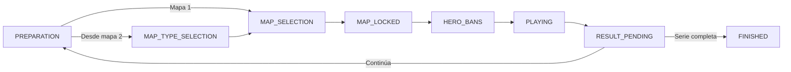

# API Goonginga · Java y Spring Boot

Java 21, Spring Boot 4.1.1 y PostgreSQL 18. Implementa la API del producto;
los dos frontends continúan siendo Next.js/React. Compose ejecuta esta API
en el servicio `backend`. El código Express queda como referencia y para
recuperación durante la transición.

**Para aprender el lenguaje, empieza por [APRENDER_JAVA.md](docs/APRENDER_JAVA.md).**
**Para desplegar, consulta [DEPLOYMENT.md](../migration-uidesign/DEPLOYMENT.md).**

## Organización

```text
src/main/java/com/overtimeproductions/goonginga/
├── GoongingaApplication.java       # punto de entrada
├── config/                        # JWT, CORS, salud y reloj
├── common/                        # permisos, SQL y archivos
├── league/                        # equipos, temporada, partidos y playoffs
├── stats/                         # estadísticas
├── network/                       # OAuth Discord y miembros
├── catalog/                       # mapas y héroes
├── news/                          # noticias
├── announcements/                 # anuncios, plantillas y configuración
├── overlay/                       # recursos de transmisión
├── minigames/                     # Jeopardy
├── familyfeud/                    # preguntas, lobby, rondas, juego y SSE
├── practice/                      # panel de práctica y controles visuales
└── draft/
    ├── domain/                    # estado, valores y enums
    ├── data/                      # entidades y repositorios JPA
    ├── context/                   # consultas a tablas existentes
    ├── access/                    # capitán, gestor y enlace OBS
    ├── api/                       # DTO, lecturas y errores
    ├── application/               # coordinación compartida
    ├── preparation/               # creación, primer turno y reinicio
    ├── mapselection/type/         # elección de modo
    ├── mapselection/pick/         # elección de mapa
    ├── mapselection/locked/       # mapa confirmado
    ├── bans/                      # turnos de veto
    ├── playing/                   # juego y cierre del mapa
    ├── result/                    # resultado, empate y corrección
    ├── finished/                  # fase terminal
    ├── clock/                     # pausa y vencimientos
    └── migration/                 # conversión y archivo del historial anterior
```

Los controladores reciben HTTP; los servicios coordinan permisos y transacciones;
los repositorios consultan PostgreSQL. Las fases del draft contienen sus propias
reglas, separadas de HTTP y SQL. Los DTO representan la respuesta, las entidades
representan filas y el dominio representa reglas.



El primer mapa es Control. Después el perdedor elige modo y mapa; en empate
elige quien no eligió el anterior. Hay cuatro turnos de ban, incluido NO BAN.
Los vencimientos automáticos y las acciones HTTP usan las mismas reglas.

## Base de datos

Se conserva PostgreSQL, sus IDs, usuarios, equipos, estadísticas y archivos.
Cambiar el lenguaje del backend no exige cambiar el motor de base de datos.

| Esquema / tablas | Acceso | Responsabilidad |
| --- | --- | --- |
| `public`, tablas existentes | JDBC y SQL parametrizado | Datos y contratos existentes. |
| `spring_draft.draft_sessions` | JPA | Fase, turno, reloj y versión. |
| `spring_draft.draft_maps` | JPA | Elección y resultado de cada mapa. |
| `spring_draft.draft_bans` | JPA | Turnos de ban. |
| `spring_draft.practice_display_controls` | JDBC | Marcadores y bans visuales de práctica. |
| `spring_draft.schedule_notifications` | JDBC | Cola de avisos Discord con reintentos. |
| `spring_draft.legacy_imports` | JDBC | Registro y huella del historial importado. |

Flyway aplica `db/migration/V1...V5`; Hibernate solo valida el esquema.
`db/public-bootstrap.sql` prepara una base **nueva** y vacía. Compose lo monta
para la inicialización del volumen nuevo. No se ejecuta sobre el volumen existente.
Las fechas públicas mantienen la interpretación UTC de Prisma; las nuevas usan
`TIMESTAMPTZ`. Los mapas retirados del catálogo conservan su ID en el historial;
su tipo desconocido permanece nulo y no se permite seleccionarlos en un juego nuevo.

## Compilar y ejecutar

Instala JDK 21 y configura `JAVA_HOME`. El wrapper descarga Maven.

```powershell
cd backend-springboot
.\mvnw.cmd -B -DskipTests package
$env:SPRING_DATASOURCE_URL = 'jdbc:postgresql://localhost:5432/goonginga_local'
$env:SPRING_DATASOURCE_USERNAME = 'goonginga'
$env:SPRING_DATASOURCE_PASSWORD = 'tu-password-local'
$env:NETWORK_JWT_SECRET = 'tu-secreto-existente-de-al-menos-32-bytes'
java -jar target/backend-springboot-0.0.1-SNAPSHOT.jar
```

El puerto local por defecto es 3002. Spring no carga `.env` automáticamente:
exporta las variables de [.env.example](.env.example) o usa Compose.
En producción Compose reutiliza `migration-uidesign/backend/.env` para OAuth,
JWT y la clave OBS; inyecta las credenciales JDBC desde el entorno de PostgreSQL.
Los permisos y el estado activo del usuario se vuelven a consultar en cada petición.

## Importar drafts anteriores

Primero revisa una copia aislada. Detén las escrituras Node antes de aplicar
la conversión en la base definitiva. Los comandos de importación deben desactivar
los schedulers y las notificaciones:

```bash
java -jar target/backend-springboot-0.0.1-SNAPSHOT.jar \
  --migration.mode=check --server.port=0 --draft.timeouts-enabled=false \
  --feud.timeouts-enabled=false --notifications.enabled=false
# Mismo comando con --migration.mode=apply para importar.
```

`check` reporta READY, MIGRATED o BLOCKED. `apply` se revierte por completo si
algún registro está bloqueado; repetirlo no duplica datos. El arranque normal
exige que la importación esté completa. También existe la API ADMIN:
`GET` y `POST /admin/migrations/legacy-drafts`.

`DraftTable` y `DraftAction` antiguos se conservan como archivo. Tras importar,
las escrituras pasan por comandos de fase; editar directamente el archivo
antiguo devuelve 409. No hay sincronización entre ambos motores de draft.
Algunos tiempos históricos se reconstruyen a partir de la elección o la fase
disponible porque Node no guardaba una hora independiente para cada resultado.

## Integraciones

OAuth Discord usa el mismo callback `/network-auth/discord/callback`, los dos
dominios permitidos y el mismo JWT de sesión. Los horarios generan avisos mediante
una cola persistente con reintentos. Las imágenes subidas se guardan en `media/`,
compartido por el frontend y Java. Versus images se generan con Java2D y las fuentes
incluidas en la imagen Docker. Family Feud conserva eventos SSE y los vencimientos.

## Verificación realizada · 2 de octubre de 2026

- Compilación de 130 clases y empaquetado; construcción real de la imagen Docker.
- Auditoría de las 141 rutas Node: todas tienen correspondencia en Java.
- Flujos HTTP de draft, permisos, pausa, vencimientos, empate, undo y reinicio.
- Playoffs completos: cuartos, semifinales, final BO7, cierre y reinicio protegido.
- CRUD de módulos, práctica, Jeopardy y Family Feud, incluidos SSE y Fast Money.
- OAuth contra proveedor simulado y avisos contra webhook local: reintento y edición.
- Ambos frontends compilan. Copia real: 46 drafts importados, cero bloqueados,
  lectura de todos y concordancia de marcadores competitivos.
- Producción: API Spring Boot saludable, sesiones con la clave existente,
  CORS de Game Nights, archivos preservados, imágenes versus y ambos sitios.
  La partida antigua de Family Feud con un representante ausente continúa
  correctamente; la revisión final no encontró errores en los logs.

El contenedor Node de la API fue sustituido. Se conservan su código, la imagen
anterior y el dump previo al cambio como respaldo de recuperación.

Los scripts de revisión temporal viven fuera del repositorio. El consentimiento
humano de Discord y la entrega a un canal real requieren una sesión real; la
revisión automatizada de OAuth y webhooks usó un proveedor simulado.
