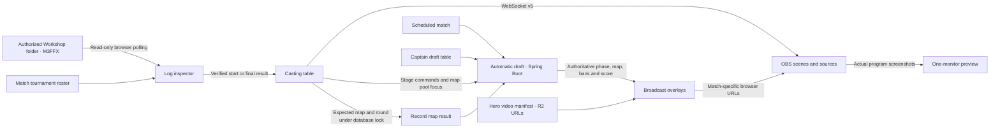

# Casting system

The match lineup is `/casting-dashboard`. **Start Casting** opens
`/casting-table/{matchId}`, the operator room. The captain/manager draft remains
`/draft-table/{matchId}`. Broadcast-only output uses
`/overlay/casting/{matchId}?view=…&key=…`; it never exposes the OBS password or login token.



## Operator flow

1. A new match owns a draft in `STARTING` before either captain is ready.
   Existing, unplayed scheduled matches are provisioned when listing/opening
   drafts. Matches with existing legacy progress require their existing audited
   migration; progress is never replaced by a fresh draft.
2. Choose the match from its square logo card. The room opens with the draft
   broadcast preview. Choose monitor count, header visibility and dark/bright
   appearance in the settings cog.
3. Connect OBS using profile credentials or enter the password in this room.
   The room discovers scene aliases, reuses compatible sources for this match,
   and provisions missing scenes and browser sources. Names from another match
   are preserved. Setup keeps retrying incomplete configuration every six
   seconds while connected; a missing Overwatch Game Capture needs to be added
   in OBS. Capture must target Overwatch and produce nonzero image dimensions.
4. Select `Documents / Overwatch / Workshop` **before Playing**. The browser
   requests read access; OBS never requests a folder path. Only new game events
   after arming are eligible. File handles and session passwords are not written
   to browser storage. Unsupported browsers use manual result controls.
5. Waiting for captains → **Start map picking** → captain map selection →
   **Start hero bans** → four captain ban turns → `PLAYING`.
6. With **Automatic scenes ON**, `PLAYING` first shows the four hero videos.
   A verified first-round `setup_complete` switches to Overwatch. The final
   `match_end`, mapped through at least one unique website username on each
   side, records the winner and switches to winner cards. Game-start evidence
   is queued while OBS is preparing. A queued event must still belong to the
   current match, round and map before it can act.
7. Winner cards stay on air. The caster manually chooses **Start next round**
   when both captains are ready. With **Automatic scenes OFF**, scene buttons
   and manual winner/draw controls drive the same workflow. Verified results
   remain available for manual registration or retry after a request failure.

The room can focus each map-pool type and individual map using the existing
server-controlled overlay. Every command and result continues to use Spring
Boot as the authoritative state. Casters receive narrow production permissions;
resets, undo, schedule administration and captain picks retain their existing
permissions.

## OBS preparation and preview

The six scene roles are Waiting for captains, Draft table, Map pool, Hero bans,
Overwatch and Winner cards. Overlay sources render a 1920×1080 design scaled to
the OBS base canvas. The older 1280×720 overlay routes remain compatible.

Configuration readiness verifies URLs (including the broadcast key), scene
items, enabled state, placement and the real game-capture dimensions through
OBS readback. It cannot prove a remote browser page has rendered every font or
video; `needsVisualCheck` remains true. Check the program before going live.
Provisioning does not start or stop the stream.

One-monitor mode includes an actual OBS program screenshot every 1.5 seconds,
so it also reflects scene changes made directly in OBS. This is a snapshot
preview without audio. Before connection it shows the animated overlay itself.
Two-monitor mode displays:

> For a better experience, move OBS to your second monitor. This is recommended, but not required.

## Hero videos

Upload the clips to R2, then fill
`migration-uidesign/frontend/public/casting/hero-videos.json` with one HTTPS URL
per hero. Hero IDs, exact names, or lowercase names are accepted. A custom public
manifest can be configured with `NEXT_PUBLIC_HERO_VIDEO_MANIFEST_URL`.

```json
{
  "ana": "https://YOUR_R2_DOMAIN/heroes/ana.webm",
  "reinhardt": {
    "url": "https://YOUR_R2_DOMAIN/heroes/reinhardt.webm",
    "objectPosition": "50% 50%"
  }
}
```

The chosen format is WebM with transparency. The manifest ships empty until real clips are uploaded. Portraits remain
visible for unconfigured or failed videos. Videos play muted, loop, and center
crop with `object-fit: cover`. Each team's two bans occupy its side of the
frame over the selected map. Transparent WebM preserves the map behind the
hero; an opaque video retains its own background inside the cropped rectangle.
Cropping does not remove that background. CORS must permit the site's origin
for a remotely hosted manifest; video URLs must be public and stable for OBS.

## Log boundaries and pending validation

The implementation uses real ScrimTime row schemas, not invented game events.
See [CASTING_LOGS.md](CASTING_LOGS.md) for exact columns, freshness and identity
rules. It rejects stale files, duplicated names, conflicting game sessions,
unknown map names, merged logs and unfinished writes. Finished results must
remain stable across consecutive reads. Equal payload scores do not prove a
draw; no winner is inferred from damage, healing or kills.

SupaScrim's Push extension still needs a completed M3FFX log sample. Those
results and ambiguous equal-score endings stay manual until the actual fields
are verified. A folder selected midgame cannot prove a fresh start and requires
manual review. Browser folder access requires Chrome/Edge in a secure context.
Connecting an HTTPS site to local OBS also depends on browser local-network
permissions and OBS WebSocket configuration; connection errors remain visible.

Caster submissions include `expectedGameNumber` and `expectedMapId`. Both the
end-map and result commands validate them while holding the match lock, so a
delayed request cannot mutate the following round. Existing manager clients
that omit these fields remain compatible.

Sources: [M3FFX author page](https://workshop.codes/M3FFX),
[OBS WebSocket v5 protocol](https://github.com/obsproject/obs-websocket/blob/master/docs/generated/protocol.md),
[browser directory picker](https://developer.mozilla.org/en-US/docs/Web/API/Window/showDirectoryPicker),
[verified ScrimTime schema](https://github.com/luxdotdev/parsertime/blob/79bec6bc1c71cc0a16827625983f2eda6624427c/apps/web/src/lib/parser/schema.ts).
