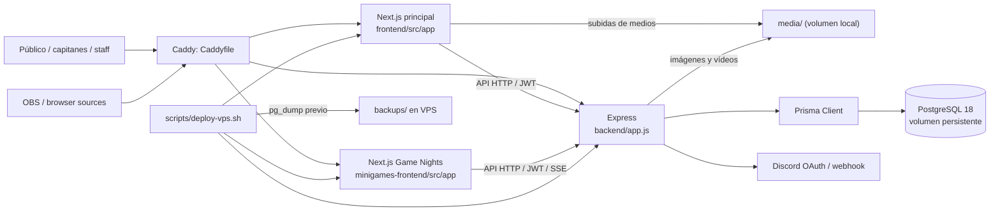
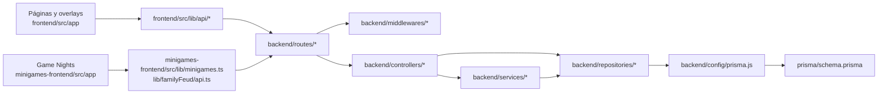
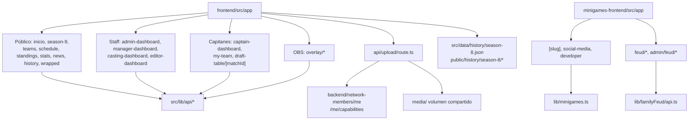

# Grafo de código de OTP / Goonginga

Actualizado: 2026-09-26. Este mapa describe las entradas que están conectadas al
código versionado. Para investigar una función, siga primero la flecha desde la
ruta de usuario hasta el modelo; evite recorrer todo el repositorio.

## 1. Sistema en ejecución

**Entradas de producción:** `migration-uidesign/compose.yaml` levanta
`database`, `backend`, `frontend`, `minigames` y `caddy`. La API ejecuta
`prisma migrate deploy && node app.js` desde
`migration-uidesign/backend/package.json`. Caddy publica la API bajo
`/backend/*`, la web principal en el dominio principal y Game Nights en otro
dominio. La web principal y la API comparten `media/`; los assets estáticos
de héroes y mapas se copian al contenedor de la API durante el build.

## 2. Ruta de una petición

El patrón no es uniforme en todos los endpoints: algunos controladores consultan
Prisma directamente o usan utilidades sin pasar por un servicio. Empiece por
`backend/app.js` para ver el prefijo montado y luego abra el archivo del mismo
nombre en `routes/`, `controllers/`, `services/` y `repositories/` según
corresponda.

| Dominio | Ruta API | Archivos de entrada |
| --- | --- | --- |
| Temporadas y plantillas | `/tournament`, `/season-roster` | `routes/tournament.js`, `routes/seasonRoster.js` |
| Equipos, encuentros y estadísticas | `/team`, `/match`, `/playerStat` | `routes/team.js`, `routes/match.js`, `routes/playerStat.js` |
| Draft | `/draft`, `/draftTable`, `/draftAction` | `routes/draft.js`, `controllers/draft.js` |
| Contenido y overlays | `/news`, `/announcements`, `/overlay-assets` | `routes/news.js`, `routes/announcement.js`, `routes/leaderboardOverlayAsset.js` |
| Catálogo | `/map`, `/hero` | `routes/map.js`, `routes/hero.js` |
| Identidad y juegos | `/network-auth`, `/network-members`, `/minigames`, `/family-feud` | Rutas homónimas en `backend/routes/` |
| Herramienta de desarrollo | `/dev/draft-app` | `routes/devDraftApp.js` (requiere rol `DEVELOPER`) |
| Salud | `/health`, `/health/db` | `backend/app.js` |

## 3. Frontends y flujos

La web principal resuelve sesión en `src/features/session/` y navegación de
temporada en `src/features/tournament/`. Las páginas de `overlay/*` son
fuentes de navegador para OBS. `src/announcements/` renderiza anuncios y
`backend/announcements/` contiene sus contratos y plantillas. Game Nights
tiene su propio Next.js, pero comparte API y usuarios Network con la web principal.

## 4. Datos y archivos

| Fuente | Qué contiene | Regla de mantenimiento |
| --- | --- | --- |
| `backend/prisma/schema.prisma` | `Tournament`, `SeasonPlayer`, `NetworkMember`, `Team`, `Match`, draft, stats, anuncios y juegos | Cambios de modelo mediante migración nueva |
| `backend/prisma/migrations/` | Historial aplicado por Prisma en cada arranque de producción | Conservar íntegro; las migraciones viejas no son scripts basura |
| `frontend/src/data/history/season-8.json` | Archivo congelado de la temporada 8 | No depende de scripts de seed |
| `frontend/public/history/season-8/` | Media histórica referenciada por el JSON | Verificar referencias antes de tocar |
| `frontend/HeroImages/`, `frontend/MapImages/` | Catálogo visual servido por Express | El Dockerfile de backend lo copia |
| `media/` (ignorado) | Uploads en VPS | Volumen persistente compartido; fuera de Git |
| `backups/` (ignorado) | Dumps previos al despliegue | Respaldo local a la VPS, sin retención programada en el repositorio |

## 5. Comandos y límites

- Pruebas de API: `cd migration-uidesign/backend && npm test`.
- Comprobación de tipos y código local sin usar: `npm run typecheck` en cada frontend.
- Build de las webs: `npm run build` dentro de cada frontend.
- Despliegue: `migration-uidesign/scripts/deploy-vps.sh`, invocado por
  `deploy-goonginga.bat` en el entorno Windows del operador.
- Configuración inicial de VPS y Discord: scripts `create-vps-env.sh` y
  `configure-discord-network.sh`. Son de instalación, no se ejecutan con cada
  petición.

## 6. Dónde buscar primero

| Pregunta | Primera parada |
| --- | --- |
| ¿Quién monta un endpoint? | `backend/app.js` y luego `backend/routes/<dominio>.js` |
| ¿Quién puede ejecutarlo? | Middleware en la ruta y `backend/middlewares/` |
| ¿Qué cambia en BD? | Controlador/servicio, repositorio y `schema.prisma` |
| ¿Quién lo llama desde la web? | `frontend/src/lib/api/<dominio>.ts`, luego `src/app/` |
| ¿Qué se ve en OBS? | `frontend/src/app/overlay/` y `src/app/overlay/components/` |
| ¿Qué alimenta Game Nights? | `minigames-frontend/src/lib/minigames.ts`, `src/lib/familyFeud/api.ts` |
| ¿Dónde viven imágenes subidas y quién puede modificarlas? | `frontend/src/app/api/upload/route.ts`, `backend/routes/networkMember.js`, `backend/app.js`, `media/` |
| ¿Cómo se recupera un despliegue? | `scripts/deploy-vps.sh`, `backups/`, `DEPLOYMENT.md` |

El grafo se obtuvo de entradas Next.js, imports estáticos de TypeScript/JS,
`require`, montajes de Express, scripts npm, Docker y referencias de
despliegue. Las URLs externas, imports calculados y tareas programadas fuera de
la VPS no se pueden demostrar únicamente desde este repositorio.
